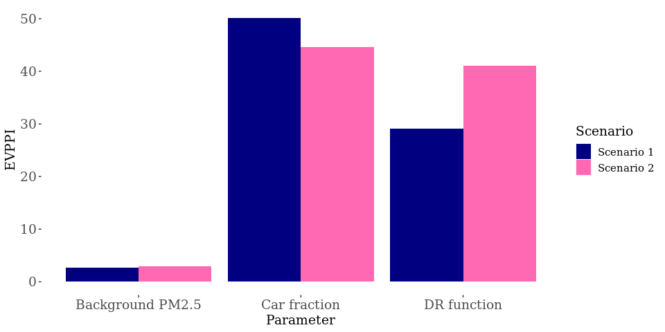

Value of information
================

Value of information (VOI) is a measure of how much one uncertain variable tells you about another uncertain variable. In health-impact modelling, where we have many inputs and an output of interest, we're interested in how much an uncertain input tells us about the uncertain output, so that we can anticipate how useful it would be to us to learn more about that input, particularly if there are many inputs we might consider learning about.

The attached example computes the expected value of perfect partial information (EVPPI). That is, the value of learning a single parameter perfectly. In this example, there are three parameters, and we compare their EVPPI values.

Other VOI metrics include the expected value of perfect information (EVPI), which is the value of learning all parameters perfectly, and the expected value of sample information (EVSI), which is the value of collecting data that informs knowledge of one parameter or more. Therefore, we have that EVSI ≤ EVPPI ≤ EVPI.

This example
============

The attached example uses a simplified, idealised health-impact model taken from the "integrated transport and health" suite of models. It consists of a single demographic group, who are female and aged 45 to 59. We have a value for that group's incidence of stroke events, which is a measure of their health burden. Their stroke incidence is 18,530. We're interested to predict the health burden in "scenarios" in which something about their environment changes relative to the "baseline", which is the current state of affairs.

We have an estimate of the background level of PM2.5, a class of pollutants with diameter less than 2.5 micrometers with associations to chronic diseases; we have an estimate of the proportion of PM2.5 that is attributable to car use; we have an estimate of the dose--response relationship between PM2.5 and incidence of stroke; and we have two scenarios, one in which car use decreases, and one in which car use increases. We use a model to predict what the health burden will be in the different scenarios, and we use EVPPI to understand which uncertainties in our model drive the uncertainty in the estimated health burden.


Results
=======

The distributions of expected health burdens in terms of incidence are


So what are the parameters that we could most usefully learn to increase precision in our estimates for the two scenarios?

EVPPI method
------------

EVPPI is evaluated by regressing the outcome against each parameter in turn.

``` r
# initialise empty matrix for evppi results
evppi <- matrix(0,ncol=ncol(result)-1,nrow=ncol(parameter_samples))
# loop over results, held in columns, omitting the first (baseline)
for(j in 2:ncol(result)){
  # extract outcome vector y
  y <- result[,j]
  # compute variance
  vary <- var(y)
  for(i in 1:ncol(parameter_samples)){
    # extract parameter vector x
    x <- parameter_samples[,i];
    # write y as a smooth model of x
    model <- gam(y~s(x)); 
    # compute variance in prediction
    pred_var <- mean((y-model$fitted)^2)
    # calculate raw evppi as the expected reduction in variance
    raw_evppi <- vary-pred_var
    # calculate evppi as a percentage of observed variance
    evppi[i,j-1] <- raw_evppi/vary*100;
  }
}
```

EVPPI result
------------

|                        |  Scenario 1|  Scenario 2|
|------------------------|-----------:|-----------:|
| Background PM2.5       |        53.1|        34.8|
| Car fraction           |        24.0|        39.5|
| Dose-response estimate |        13.8|        19.2|



So, learning the background PM2.5 concentration better would most increase precision for our estimate under a car decrease scenario. Learning the car fraction of background PM2.5 concentration better would most increase precision for our estimate under a car increase scenario.

------------------------------------------------------------------------

Model details
=============

The outcome, the incidence, is a number *y*. We considered two scenarios, a decrease in car use (scenario 1) and an increase in car use (scenario 2), but let's consider for now that there is just one, for simplicity of notation, and let's call the change in travel *D*, so that if there were 1,000 km of travel in the baseline, there are 1,000*D* km of travel in the scenario. So, there is one outcome, *y*, and it is the stroke incidence in the scenario conditions.

There are three uncertain inputs, *x*<sub>1</sub>, *x*<sub>2</sub> and *x*<sub>3</sub>. We define *x*<sub>1</sub>, the background PM2.5 concentration, to have a lognormal distribution with mean and variance parameters that we specify. We define *x*<sub>2</sub>, the fraction of PM2.5 attributable to cars, to have a Beta distribution with parameters alpha and beta that we specify.

Then the PM2.5 concentration in the scenario is

PM2.5 = *x*<sub>1</sub>(*x*<sub>2</sub>*D* + 1 − *x*<sub>2</sub>),

that is, the amount contributed by cars, scaled by *D*, added to the amount that exists independently of cars.

The input *x*<sub>3</sub> operates on the relationship between PM2.5 and stroke. There exists a function, *f*(PM2.5), that maps the PM2.5 concentation onto the relative risk (RR) of stroke, which is learnt from observational data. The function *f*(PM2.5) defines a dose--response relationship, where the dose is the PM2.5 and the response is relative risk of stroke. The risk is relative to a PM2.5 value of 0, so the relative risk at PM2.5=0 is 1. We could write

relative risk of stroke (*R*) = *f*(PM2.5).

However, we have some uncertainty about the accuracy of the dose--response relationship. We capture this with our third parameter *x*<sub>3</sub>, which has a lognormal distribution centred on 1, and it reflects the range of values we think are plausible for this relationship. Now the relative risk is multiplied by some scalar:

*R* = 1 + (*x*<sub>3</sub> − 1)*f*(PM2.5).

For our final computation, we also need the relative risk for the baseline, *R*<sub>0</sub>:

*R*<sub>0</sub> = 1 + (*x*<sub>3</sub> − 1)*f*(*x*<sub>1</sub>).

The scenario RR will be a relative increase or a relative decrease from the baseline RR (*R*<sub>0</sub>), and this relationship is applied to the baseline burden of disease in order to estimate the burden of disease in the scenario:

*y* = 18530*R*/*R*<sub>0</sub>.
